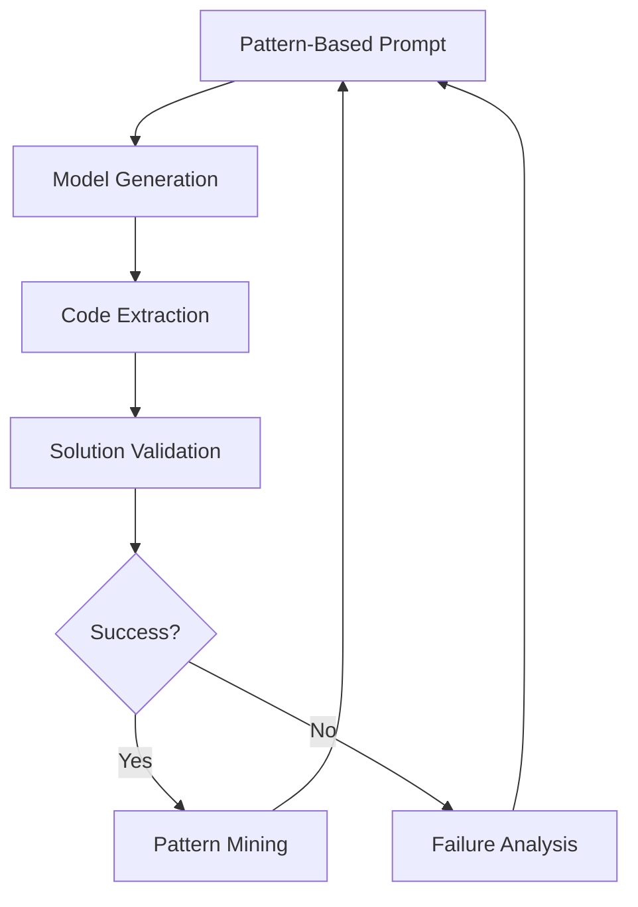

# Hamiltonian Path Discovery: Iteration Process

This document explains the iterative process used to discover, validate, and improve Hamiltonian path finding algorithms through pattern mining and continuous improvement.

## Overview

The system uses a multi-stage iterative process that combines:
1. Pattern-based prompting
2. Solution validation
3. Pattern mining
4. Knowledge accumulation
5. Continuous improvement

## Initial Prompting

### Base Prompt Structure
The initial prompt includes:
- Graph representation (adjacency matrix)
- Problem constraints
- Example format for solutions
- Basic theoretical insights

### Pattern Integration
Even in the first iteration, the prompt includes:
- Known successful patterns for similar graphs
- Vertex degree analysis
- Connectivity insights
- Performance considerations

## Iteration Cycle

### 1. Solution Generation


### 2. Pattern Mining
For each successful solution, we extract:
- Code patterns (successful implementations)
- Structural patterns (graph properties used)
- Performance patterns (efficiency insights)
- Novel algorithmic ideas

### 3. Knowledge Storage
We persist:
1. **Successful Code**
   - Complete implementations
   - Function signatures
   - Key algorithmic components

2. **Graph Patterns**
   - Start/end vertex selection strategies
   - Subpath patterns
   - Pruning techniques

3. **Performance Metrics**
   - Execution time
   - Success rate
   - Graph size handling

4. **Novel Discoveries**
   - New algorithmic approaches
   - Optimization techniques
   - Theoretical insights

### 4. Feedback Integration

The system integrates knowledge through:

1. **Prompt Enhancement**
   ```python
   prompt = base_prompt + {
       "successful_implementations": top_performing_code,
       "pattern_insights": discovered_patterns,
       "performance_guidance": timing_analysis
   }
   ```

2. **Pattern Prioritization**
   - Patterns are ranked by:
     * Success rate
     * Performance impact
     * Generalizability
     * Novelty

3. **Cross-Pollination**
   - Successful patterns from one graph size inform solutions for others
   - Novel approaches are tested across different graph types
   - Performance insights guide optimization

## Novel Idea Generation

The system encourages novel discoveries through:

1. **Pattern Combination**
   - Mixing successful approaches
   - Hybridizing algorithms
   - Combining optimization strategies

2. **Constraint Relaxation**
   - Allowing experimental approaches
   - Testing unconventional patterns
   - Exploring theoretical boundaries

3. **Performance Optimization**
   - Time-space tradeoffs
   - Parallel processing strategies
   - Novel data structures

## Verification and Iteration

### Verification Process
1. Syntactic validation
2. Runtime execution
3. Solution correctness
4. Performance benchmarking
5. Pattern extraction
6. Knowledge integration

### Iteration Goals
Each iteration aims to:
1. Improve success rate
2. Reduce computation time
3. Handle larger graphs
4. Discover novel patterns
5. Generate theoretical insights

## Expected Outcomes

Through this process, we expect to:

1. **Discover Novel Algorithms**
   - New approaches to Hamiltonian path finding
   - Hybrid solutions combining multiple strategies
   - Specialized algorithms for specific graph types

2. **Generate Theoretical Insights**
   - New graph properties relevant to path finding
   - Pattern-based complexity analysis
   - Novel pruning strategies

3. **Improve Performance**
   - Better time complexity
   - Reduced space requirements
   - More efficient implementations

4. **Build Knowledge Base**
   - Reusable code patterns
   - Graph analysis strategies
   - Performance optimization techniques

## Storage and Persistence

All discoveries are stored in:
1. Pattern state files (JSON)
2. Benchmark results
3. Implementation archives
4. Documentation updates

This creates a growing knowledge base that informs future iterations and enables continuous improvement of the solution space.
